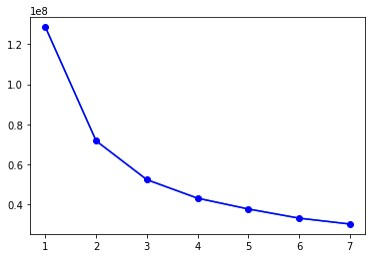

BalanceSHAP
=================
- [BalanceSHAP Introduction](#balancedshap-introduction)
    - [Description](#description)
    - [Citation](#citation)
    - [Contact](#contact)
- [BalanceSHAP Demo](#balanceshap-demo)
    - [Install the library](#install-the-library)
    - [Load data](#load-data)
    - [Train the targeted model](#train-the-targeted-model)
    - [BalanceSHAP: Generate background and explanation data](#balanceshap-generate-background-and-explanation-data)
        - [Background data](#background-data)
        - [Explanation data](#explanation-data)
    - [BalanceSHAP: SHAP value computation](#balanceshap-shap-value-computation)
    - [SHAP: Plotting](#shap-plotting)


# BalanceSHAP Introduction 
## Description
BalanceSHAP is a light-weight package, integrated with balancing procedures for background and explanation data based on original SHAP. In the face of data imbalance, which is prevalent in medical datasets, we are concerned that such data imbalance will add noise to model explanations. We anticipate that by balancing the background and explanation data, we may improve SHAP explanations and discriminate the meaningful signals from the noises.  

Our findings suggest that: 
- Data imbalance can result in inaccurate SHAP explanations, which appears as abnormal points on the beeswarm plot that deviate significantly from the general trend of association between variable values and corresponding SHAP values.
- The balancing strategy for background data can help reduce the "abnormal points" on explanation results in terms of beeswarm plot. "Abnormal points" refers to those points contrary to the general association bettwen feature contribution and value. 
<div class="figure" style="text-align: center">


<figcaption align = "left"><b>

(a) **unbalanced background** & unbalanced explanation data  
(b) **balanced background** & unbalanced explanation data</b></figcaption>
</div>

- The balancing strategy for explanation data will not result in loss of informantion in terms of model explanations; instead, it can contribute to the improvement of time efficiency in SHAP applications. 
<div class="figure" style="text-align: center">


<figcaption align = "left"><b>

(a) balanced background data & **unbalanced explanation data**  
(b) balanced background data & **balanced explanation data**</b></figcaption>
</div>
The application of BalanceSHAP consists 3 steps:  

1. Building up the targeted model (via Pytorch or Tensorflow)
2. Generating balanced background and explanation data
3. Computing SHAP values and plotting

## Citation
Liu M, Ning Y, Yuan H, Eng Hock Ong M, Liu N. Balanced background and explanation data are needed in explaining deep learning models with SHAP: An empirical study on clinical decision making. arXiv e-prints. 2022:arXiv:2206.04050-arXiv:2206.04050. (https://arxiv.org/abs/2206.04050)
## Contact
- Mingxuan Liu (Email: <m.liu@duke-nus.edu.sg>)
- Nan Liu (Email: <liu.nan@duke-nus.edu.sg>)

# BalanceSHAP Demo
## Install the library
The original SHAP library will be installed simultaeously with balanceSHAP.
```sh
pip install BalanceSHAP
```
## Load data
In this demo, we tackle the data imbalance in the binary problem, where the outcome is labelled by 0 (the majority class) or 1 (the minority class).
```python
data = pd.read_csv("./data/data.csv")
feature_names = data.drop(columns="label").columns
num_vars = len(feature_names)
event_rate = round(np.mean(data["label"] == 1), 3)
mor = event_rate 
```
## Train the targeted model
After conducting regular data preparation procedures like splitting of predictors (X) and outcome (y), standord normalization, tensor-conversion, batch-loader, etc., a targeted model `model` can be built. (More details refer to [Demo.ipynb notebook](https://github.com/nliulab/BalanceSHAP/blob/main/Demo.ipynb).)

## BalanceSHAP: Generate background and explanation data
### Background data
The background data serves for computation of class baselines. Through this function, we can generate a background data with specific size and minority-overall rate (e.g., 0.5 for balance).
- data: data frame, data source for generating backgound data. 
- bg_size: integer, the size of background data. 
- bg_mor: float, targeted minority-overall rate
```python
unbalanced_background_data = process.generate_background(data=train_data, bg_size=1000, bg_mor=event_rate) # stratify sampling
background_data = process.generate_background(data=train_data, bg_size=1000, bg_mor=0.5)
```
### Explanation data
The explanation data serves for SHAP computation, that is, the SHAP explainer only produces SHAP values for the observations in the explanation data.  

To better compose the explanation data, we applied K-Means-Based undersampling approach to capture the patterns for the observations in the majority class. Before generation the explanation data, "elbow" method can be helpful to determine the economical number of clusters for minimized within-cluster sum of squared errors (WSS).

- data: data frame, observations in the majority class for clustering.
- kmax: maxmium of clusters  
- show: bool, whether to show the elbow plot, default is `True`. Trun it to `False` to save the figure.
```python
kmax = 7
majority_class = val_data.loc[val_data["label"] == 0, ].drop(columns="label")
sse = process.calculate_WSS(majority_class, kmax)
```

<div align=center>



</div>

According to the elbow plot, the number of clusters is determined as 3. May try larger numbers if more time resource available.  

- data: data frame with (binary) label named as "label"
- mor: float, targeted minority-overall rate, default - 0.5
- n_clusters: number of clusters for KMeans, default - 3
```python
unbalanced_explanation_data = val_data
explanation_data = process.undersample_kmeans(data=val_data, mor=0.5, n_clusters = 3)
```
Consider the generated background and explanation data similar to validation data, which means to manipulate them accordingly with procedures for validation data such as prodictors-extraction, standordation normalization and tensor-conversion.

## BalanceSHAP: SHAP value computation
For better supervising the computation process, we provide a progress bar based on original (deep) SHAP computation. 
<div class="figure" style="text-align: center">


</div>

- model: targeted model
- x_background: tensor, predictors in background data
- x_explanantion: tensor, predictors in explanation data
- explainer: str, options: "DeepSHAP" (default, recommended), "GradientSHAP"
```python
balanced_shaps = SHAP.shap_values(model, x_background_tensor, x_explanation_tensor)
unbalanced_shaps = SHAP.shap_values(model, x_unbalanced_background_tensor, x_unbalanced_explanation_tensor)
```

## SHAP: Plotting 
Based on the shap values calculated above, plots can be produced directly via calling functions from shap library.

For example, beeswarm plots:
```python
shap.initjs()
fig = plt.figure()
shap.summary_plot(balanced_shaps, features=x_explanation, feature_names=feature_names, plot_size='auto')
```
<div align=center>


</div>


